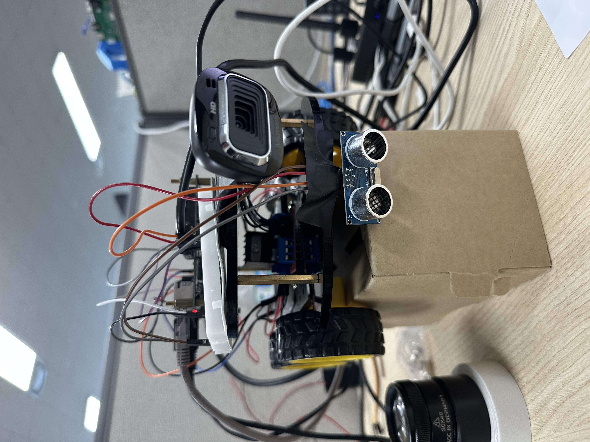

# Smart_city
❍ TOPST_BOARD를 활용한 주행 및 주행에 따른 상황 구현
❍ 원하는 정보를 정확히 생성 및 제어하는 기능 구현
❍ TOPST_BOARD를 상황에 맞게 다양한 방식으로 명령 전달
❍ 실습 및 교육에 맞는 모델 개발

□ 차량주행시 군집 주행 및 주행에 따른 상황 판별
    - 클라이언트, 서버간 통신으로 원하는 방향 및 속도 제어
    - 앞 차의 주행 정보를 뒷차에게 전달하여 앞차를 따라 주행 통신 WiFi
    - 트랙을 따라 주행하는 군집 주행 자동차
    - 차량의 속도 조절 스마트 미러와 통신하여, 날씨및 차량 통행 정보를 이용

□ 음악 및 라디오 듣기 소리 실시간 제어
    - 차량 운행시 스위치를 이용한 음악 및 라디오 재생 
    - 장애물 발견 및 사물인식 등 상황에 맞는 소리 출력
    - 차량에 라디오 기능을 탑재하여 음악 자동 플레이
    - 스마트 미러와 연동하여 자동 스피커 재생 
    - 통신 이더넷

□ 매직미러를 통한 실시간 정보
    - 캘린더, 날씨, 뉴스 등 실시간 정보 확인 등 원하는 데이터 출력 확인가능
    - 차량, 스마트 팝의 관제탑 역할
    - 통신 이더넷
    - 모듈 제작을 통한 커스텀 데이터

TOPST 외부 핀 번호
.png>)

TOPST 내부 핀 구조
.png>)

DC모터
.png>)

L298n 모터 드라이버 핀구성
.png>)

초음파 센서
.png>)

```
DC모터 +극(빨간선) -극(검은선)

TOPST 보드의 gpio89, gpio90 = 왼쪽 DC 모터의 회전, 역회전 핀
TOPST 보드의 gpio65, gpio66 = 오른쪽 DC 모터의 회전, 역회전 핀

왼쪽 DC 모터 빨간선을 모터드라이버 OUT1에 연결
왼쪽 DC 모터의 검은선을 모터드라이버 OUT2에 연결
오른쪽 DC 모터의 빨간선을 모터드라이버 OUT3에 연결
오른쪽 DC 모터의 검은선을 모터드라이버 OUT4에 연결

모터드라이버 OUT1의 신호는 IN1에서 수신
모터드라이버 OUT2의 신호는 IN2에서 수신
모터드라이버 OUT3의 신호는 IN3에서 수신
모터드라이버 OUT4의 신호는 IN4에서 수신

브레드 보드 왼쪽에 +,- 확장 라인의 +에 TOPST 보드의 GPIO89 연결
브레드 보드 왼쪽에 +,- 확장 라인의 -에 TOPST 보드의 GPIO90 연결
브레드 보드 오른쪽에 +,- 확장 라인의 +에 TOPST 보드의 GPIO65 연결
브레드 보드 오른쪽에 +,- 확장 라인의 -에 TOPST 보드의 GPIO66 연결

브레드 보드 왼쪽에 +,- 확장 라인의 +에 모터드라이버의 IN1 연결
브레드 보드 왼쪽에 +,- 확장 라인의 -에 모터드라이버의 IN2 연결
브레드 보드 오른쪽에 +,- 확장 라인의 +에 모터드라이버의 IN3 연결
브레드 보드 오른쪽에 +,- 확장 라인 -에 모터드라이버의 IN4 연결

모터드라이버의 VMS or 12V에 14.8V 배터리 빨간선 연결
모터드라이버의 GND에 14.8V 배터리 검은선 연결

TOPST 보드의 3.3V 핀을 초음파 센서에 Vcc 연결
TOPST 보드의 GND 핀을 초음파 센서에 GND 연결
TOPST 보드의 GPIO118 핀을 초음파 센서에 Trig 연결
TOPST 보드의 GPIO120 핀을 초음파 센서에 Echo 연결

USB허브를 TOPST 보드의 USB 포트에 연결
USB허브에 웹캠, 마우스, 키보드 연결
```

```
메인 차량-
웹캠으로 차선을 인식하고 양쪽의 차선의 기울기에 따라 조향값을 출력
출력된 조향값에 따라 모터 제어 ex) set_motor_speed(gpio_pin1, gpio_pin2, gpio_pin3, gpio_pin4, 1, 0, 0, 1)
소켓 통신으로 매직 미러에 조향값 송신
초음파 센서를 활용해 특정 거리가 이하일 때 모터 멈춤
wifi 모듈 연결을 통해 무선으로 소켓 통신
```



군집차량 TOPST 보드

```
DC모터 +극(빨간선) -극(검은선)

TOPST 보드의 gpio89, gpio90 = 왼쪽 DC 모터의 회전, 역회전 핀
TOPST 보드의 gpio65, gpio66 = 오른쪽 DC 모터의 회전, 역회전 핀

왼쪽 DC 모터 빨간선을 모터드라이버 OUT1에 연결
왼쪽 DC 모터의 검은선을 모터드라이버 OUT2에 연결
오른쪽 DC 모터의 빨간선을 모터드라이버 OUT3에 연결
오른쪽 DC 모터의 검은선을 모터드라이버 OUT4에 연결

모터드라이버 OUT1의 신호는 IN1에서 수신
모터드라이버 OUT2의 신호는 IN2에서 수신
모터드라이버 OUT3의 신호는 IN3에서 수신
모터드라이버 OUT4의 신호는 IN4에서 수신

브레드 보드 왼쪽에 +,- 확장 라인에 +에 TOPST 보드의 GPIO89 연결
브레드 보드 왼쪽에 +,- 확장 라인에 -에 TOPST 보드의 GPIO90 연결
브레드 보드 오른쪽에 +,- 확장 라인에 +에 TOPST 보드의 GPIO65 연결
브레드 보드 오른쪽에 +,- 확장 라인에 -에 TOPST 보드의 GPIO66 연결

브레드 보드 왼쪽에 +,- 확장 라인에 +에 모터드라이버의 IN1 연결
브레드 보드 왼쪽에 +,- 확장 라인에 -에 모터드라이버의 IN2 연결
브레드 보드 오른쪽에 +,- 확장 라인에 +에 모터드라이버의 IN3 연결
브레드 보드 오른쪽에 +,- 확장 라인에 -에 모터드라이버의 IN4 연결

모터드라이버의 VMS or 12V에 14.8V 배터리 빨간선 연결
모터드라이버의 GND에 14.8V 배터리 검은선 연결
```
.jpeg>)

